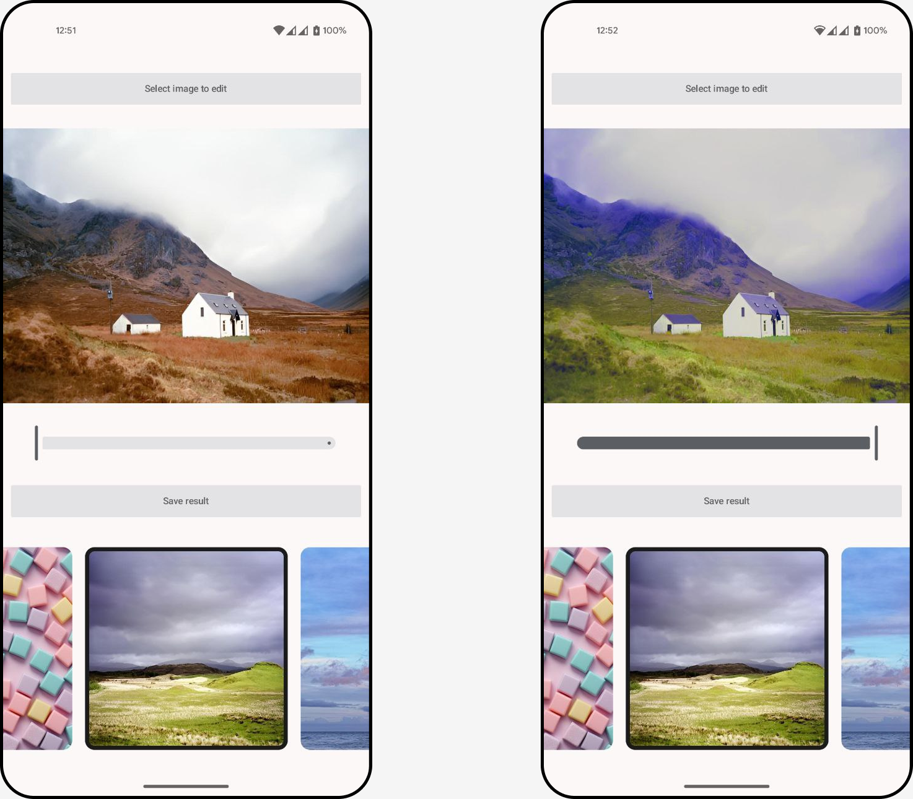
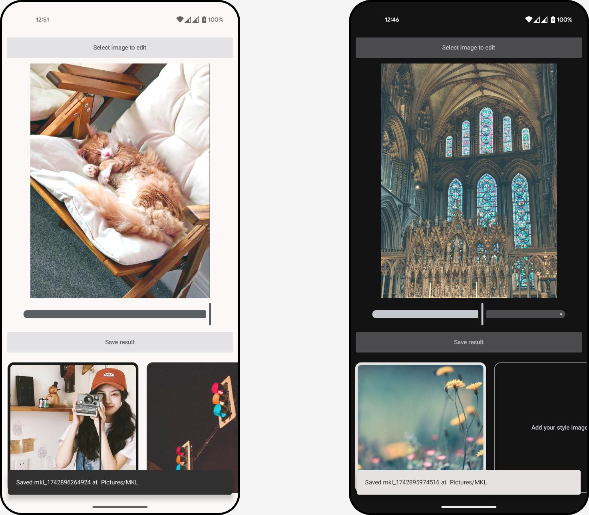

# Android App for Color Transfer

This is an Android implementation of Monge-Kantorovich Linear (MKL) color transfer algorithm by F. Pitié and A. Kokaram (2007).
Application was tested on Android 12+ devices and currenty supports only portrait mode.

Please use this instruction to run the app on the emulator and for connecting your physical Android device
https://developer.android.com/courses/pathways/android-basics-compose-unit-1-pathway-2#codelab-https://developer.android.com/codelabs/basic-android-kotlin-compose-first-app

<p align="center">
     
</p>

## Dark and Light Themes

<p align="center">
     
</p>

## Citation
For citing the original work use:
```
@inproceedings{pitie2007linear,
  title={The linear monge-kantorovitch linear colour mapping for example-based colour transfer},
  author={Piti{\'e}, Fran{\c{c}}ois and Kokaram, Anil},
  booktitle={4th European conference on visual media production},
  pages={1--9},
  year={2007},
  organization={IET}
}
```
